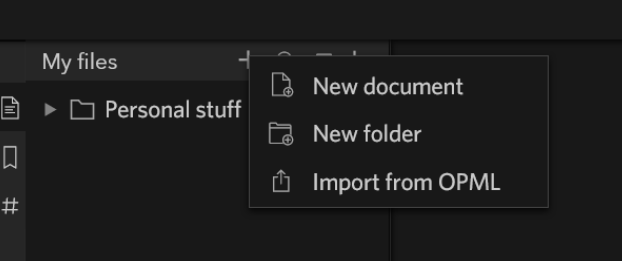
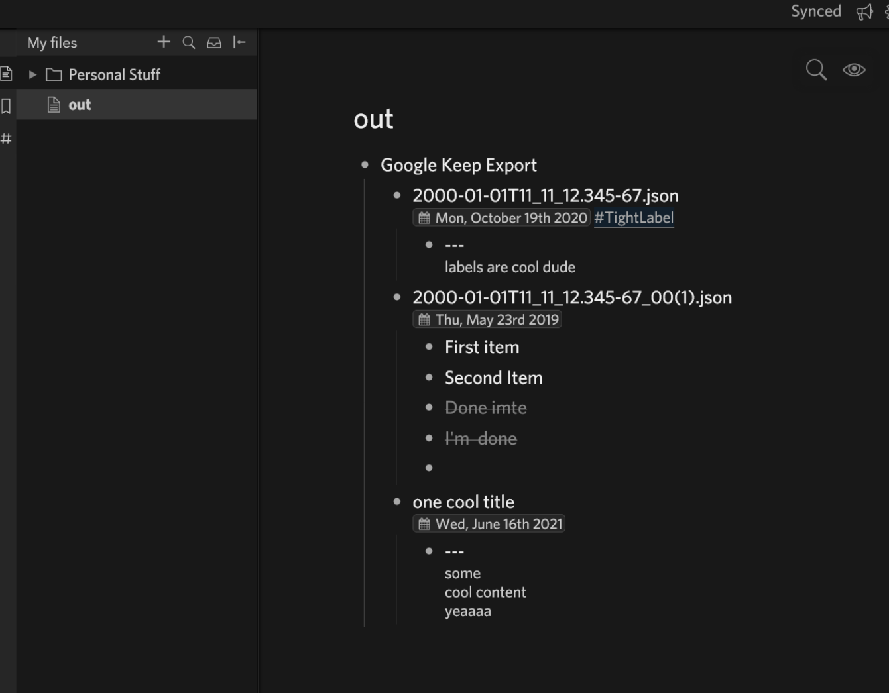
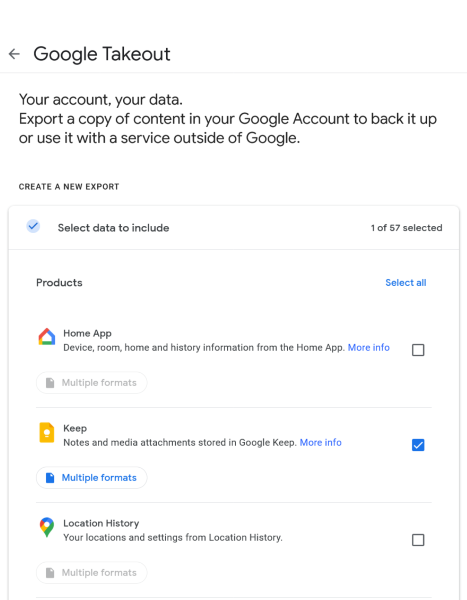

# Keep Export To Text

[](https://goreportcard.com/report/dragon1672/go-keep-export-to-text)

My hacky slappy exporting google keep data from https://takeout.google.com (which has some nice json data)

## Export / Importing Options

### Google Keep to Text Files

Each google keep note will be converted into a `txt` file.

Note this will not include things like images / colors / sharing / etc

#### Note about Google Keep note exports

- FileNames (depends on `--output_file_name_strat`)
    - The filename in the zip file will prefer the note title but parsed to be URL safe and handle collisions
        - If there is no file name it appears to take on a timestamp based on the last edit time
    - `--output_file_name_strat=direct_export`: will output the file name directly as above
    - `--output_file_name_strat=favor_date`: will attempt to output the file according to it's date `YYYY-MM-DD`
        - if there are collisions, the following files will `YYYY-MM-DD_${filename}`
- List entries do not include information about nesting
    - In google keep a checklist can have 1 level of nesting, but this data doesn't appear to be reflected in the output
      json. It might exist in the HTML, but I haven't bothered digging that deep.

#### Text Formatting

Note the format of the text file is an unstable thing to rely on, I would recommend forking this repo to make formatting
modifications, so you are working with the structured JSON data.

- The filename will reflect the same name as the takeout export filename
- File Contents will include
    - The title
    - optionally create date
    - optionally last edit date
    - The file contents
    - list contents
        - prefixed with a `[ ]` or `[X]` marking if they are complete or not
    - labels converted to `#` tags

Tip: You can do some filtering if you have grepable entries like labels

```bash
$ mkdir ma-cool-label
$ grep "#ma-cool-label" -rl . | xargs -I % cp "%" ma-cool-label/
```

### Google Keep to Markdown

Similar to text files but markdown, This can be referenced by markdown readers like https://obsidian.md/

### Google Keep to Evernote

It has been a while, but I used the windows desktop client to import them in bulk.

1. Export text files as mentioned above
2. Use client for bulk import

   eg: https://discussion.evernote.com/forums/topic/31369-archived-how-could-i-import-a-folder-with-huge-number-txt-files-and-make-the-txt-file-name-as-the-note-title/

### Google Keep to Dynalist

This program can output an opml file that can be imported into dynalist

On the upper left of the web UI: ompls files can be imported 

This will create a new note will all the imported data. 

#### Dynalist formatting

- Each entry will be imported according to it's name
    - Creation date and tags are added as a note is added as a note to the name
- list documents are represented with each entry and will be marked as complete or not
- text entries will be placed as note on a dummy entry
    - The note section handles multi-line and paragraph text much better than bulleted entries.
    - The FR for collapsable note sections
      is [still being discussed](https://talk.dynalist.io/t/collapse-expand-notes-like-children/1469) So this uses a
      dummy entry `---` to have a collapsable note section

Tip: once imported, use the search features like `Since:2020 Until:2021` to isolate date ranges and the `move` feature
to organize these entries into different notes or into hierarchies

Tip: sort entries by date

## Getting google keep data

1. go to https://takeout.google.com
2. deselect all projects and select only google keep
   
3. Wait for email to get a link to download zip
4. Use this code and reference the zipfile
    - Optionally rename the zip to `takeout-example.zip` and not have to tinker with any CLI flags
5. Do cool things with exported data